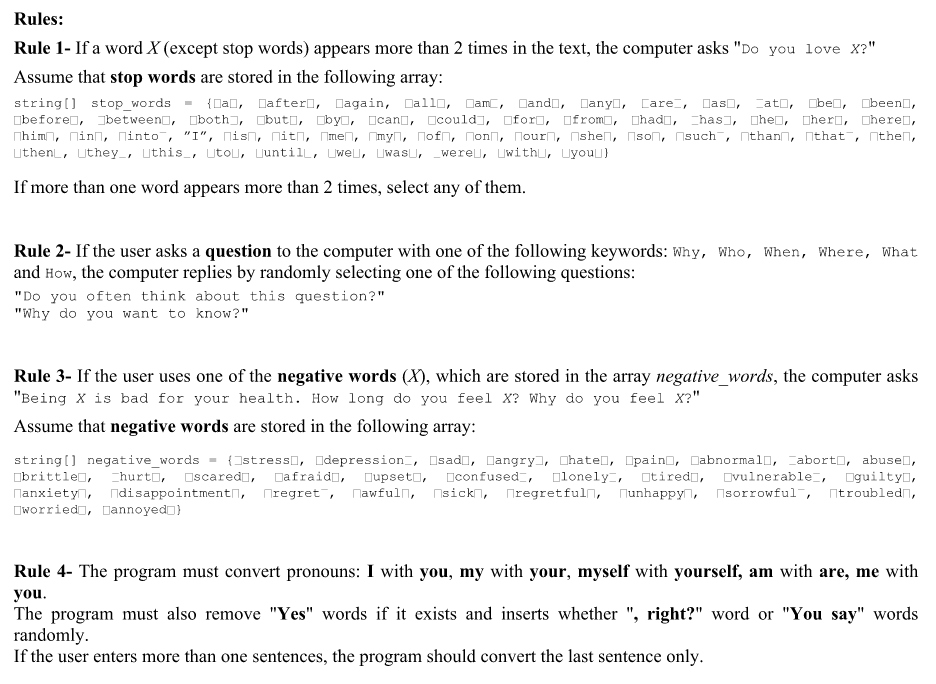
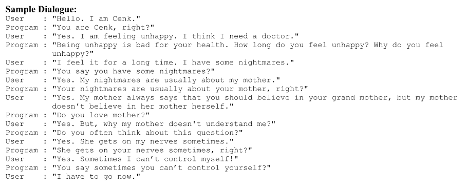

# Psychotherapist Chatbot
- A psychotherapist chatbot program that continuously reads a text from the user and then gives a response based on some
rules and keywords in the text.
- This problem falls under the domain of Artificial Intelligence. The program will simulate the behavior of a
psychotherapist. The user (patient) starts the conversation by writing a text. Then the computer (psychotherapist) asks
a question related to the text.
- Rules :

- Sample Dialogue :

